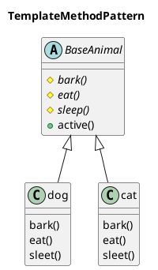
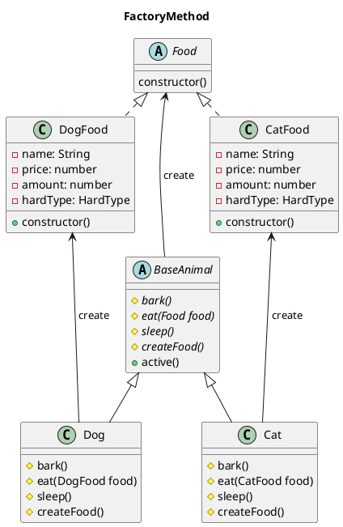
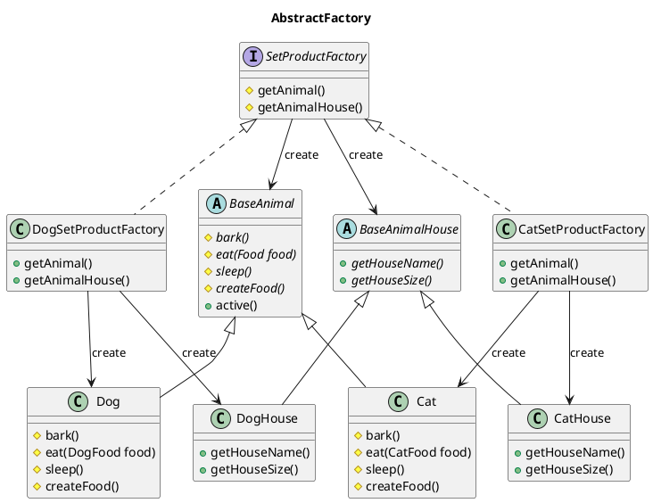
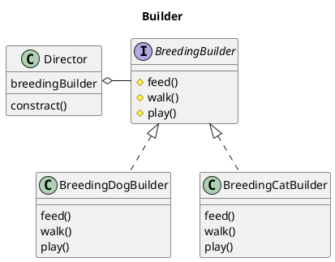
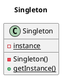

# Gofデザインパターン一覧

## 概要

### 生成に関するもの

#### クラス

- **Factory Method**：動的にサブクラス選択

#### オブジェクト

- **Abstract Factory**：工場の工場
- **Builder**：初期化手順を細分化
- **Prototype**：コピーを渡す
- **Singleton**：１インスタンスを保証

### 構造に関するもの

#### クラス

- （クラス向け）**Adapter**：継承でラッパー

#### オブジェクト

- （オブジェクト向け）**Adapter**：委譲でラッパー
- **Bridge**：拡張と実装の階層分離
- **Composite**：再帰ツリー構造
- **Decorator**：委譲で意図的フック
- **Facade**：複数クラス利用手順書
- **Flyweight**：キャッシュ付の工場
- **Proxy**：こっそりフック

### 振る舞いに関するもの

#### クラス
- **Interpreter**：独自言語の実行
- **Template Method**：子が処理断片を具体化
#### オブジェクト
- **Chain of Responsibility**：助け船ネットワーク
- **Command**：タスクキューとスタック
- **Iterator**：並んだ物を順番に処理
- **Mediator**：スター状の相互作用
- **Memento**：状態のゲッタとセッタ
- **Observer**：イベントリスナ
- **State**：状態オブジェクト
- **Strategy**：アルゴリズム切り替え
- **Visitor**：構造の便利スキャナ


## 詳細
1. パターンの特徴をつかめているか
2. クラス図が妥当か（abstractクラス と interfaceはどう使い分ける）
3. サンプルクラスがパターンを実装できているか
4. 利点と欠点が弱いから付け足したい
5. どんな時に使えば良いかとかも書けると最高

※パターンの順番はテキトー


### ***TemplateMethod***
- **特徴**
  - 親クラスが処理の枠組みのみを持ち、実装は子クラスに任せる。
  - DelegateとImpl
  - 一連の処理の流れが決まってて具体的には色々パターンがあるときに使う。
- **利点**
  - 実装上の大まかな流れを決めることができる。
  - main()でのインスタンス生成方法は変わらず、処理を変えることができる。
  - 同じような処理をするクラスをいい感じにまとめて、親クラスのメソッドで一気に実行する。
- **欠点**
  - サブクラスの数が増える。
  - 親クラスと子クラスの関連が密接

**クラス図**


**サンプル**
```java
public class Main {

    public static void main(String[] arg) {
        BaseAnimal cat = new Cat();
        cat.active();
        BaseAnimal dog = new Dog();
        dog.active();
    }
}

public class Food {
    private String name = "";   // 名前
    private int price = 0;  // 値段
    private int amount = 0; // 量

    public Food(String name, int price, int amount) {
        this.name = name;
        this.price = price;
        this.amount = amount;
    }
    public getName() {
        ...
    }
    public getPrice() {
        ...
    }
    public getAmoutn() {
        ...
    }
}

//////////////////////////////////////////
// CatとDogという似ているクラスが存在する。
// BaseAnimalを作って、大まかな処理を決めてやる。
//////////////////////////////////////////
public abstract class BaseAnimal {
    // 抽象メソッド
    protected abstract String bark();
    protected abstract void eat(Food food); // ※Food：後々はAnimal毎に食べ物を分けてあげたい。
    protected abstract void sleep(); 

    ////////////////////////////////////////////////
    // 子クラスが実装したであろう各メソッドを実行するメソッド
    ////////////////////////////////////////////////
    public void active() {
        String voice = bark();
        System.out.println(voice);
        Food food = new Food();
        eat(food);
        sleep();
    }
}

public class Cat extends BaseAnimal { 

    private String voice = "meow";

    @Override
    public String bark() {
        return voice;
    }

    @Override
    public void eat(Food food) {
        System.out.println(food.getName() + " eating");
    }

    @Override
    public void sleep() {
        System.out.println("cat is sleeping");
    }
}

public class Dog extends BaseAnimal {
    ・
    ・
    ・
}
```


### ***FactoryMethod***
- **特徴**
  - インスタンスの生成を動的に変更できるようにする。
    1. インスタンス生成用メソッドを子クラスで実装する。
    2. 親クラスのメソッドを呼ぶようにしといて、実際は子クラスで生成したインスタンスを呼び出す。
  - Mainクラス内で利用するオブジェクトを切り替えたい時（CatFoodとDogFood）にcreate***()を使って動的に切り替える
  - ポリモーフィズムを使ってインスタンスを生成しているだけのように見える
- **利点**
  - インスタンスの生成を子クラスによって変更できる
  - クラス間の依存性をごっそり削れる
- **欠点**
  - ...
**クラス図**


**サンプル**
```java
public class App {

    public static void main(String[] arg) {

        BaseAnimal cat = new Cat();
        //////////////////////////////////
        // active()メソッドの中で
        // Food をFactoryMethodで動的に変更
        //////////////////////////////////
        cat.active();

        BaseAnimal dog = new Dog();
        dog.active();
    }
}

/**
 * ベースとなる餌インターフェース
 */
public abstract class Food {
    public Food() {
    }
}

/**
 * 猫用餌クラス
 */
public class CatFood extends Food {
    private String name;
    private int price;
    private int amount;
    private HardType hardType;

    public CatFood(String name, int price, int amount, HardType hardType) {
        super();
        this.name = name;
        this.price = price;
        this.amount = amount;
        this.hardType = hardType;
    }
    ...
}

/**
 * 犬用餌クラス
 */
public class DogFood extends Food {
    private String name;
    private int price;
    private int amount;
    private HardType hardType;

    public DogFood(String name, int price, int amount, HardType hardType) {
        super();
        this.name = name;
        this.price = price;
        this.amount = amount;
        this.hardType = hardType;
    }
    ...
}


public abstract class BaseAnimal {
    // 抽象メソッド
    protected abstract String bark();
    protected abstract void eat(Food food);
    protected abstract void sleep();
    //////////////////////////////////////
    // 動的に変更したいインスタン生成用のメソッド
    //////////////////////////////////////
    protected abstract Food createFood();

    public void active() {
        String voice = bark();
        System.out.println(voice);

        /////////////////////////////////////////
        // 子クラスでOverrideして動的にFoodを生成する。
        /////////////////////////////////////////
        Food food = createFood();
        eat(food);
        sleep();
    }
}

public class Cat extends BaseAnimal { 

    private String voice = "meow";

    @Override
    public String bark() {
        return voice;
    }

    ...

    ////////////////////////////////////////////
    // 動的に変更したいインスタン生成用のメソッド（実装）
    // ※猫が餌を作るのも変な話だが..
    ////////////////////////////////////////////
    @Override
    protected Food createFood() {
        return new CatFood(null, 0, 0, null);
    }
}

public class Dog extends BaseAnimal {
    
    String voice = "bowWow";

    @Override
    protected String bark() {
        return voice;
    }

    ...

    ////////////////////////////////////////////
    // 動的に変更したいインスタン生成用のメソッド（実装）
    // ※犬が餌を作るのも変な話だが..
    ////////////////////////////////////////////
    @Override
    public Food createFood() {
        return new DogFood();
    }
}
```


### ***Abstract Factory***
- **特徴**
  - 同様な**オブジェクト群**をもつクラスをFactoryクラスから呼び出せるようにする
  - DelegateFactoryとDelegateFactoryImpl(M1)
    ※Delegateを全て取得する  
  →オブジェクト群を取得したいというよりも、ModelとControllerを切り離したいのか？
  - オブジェクトの切り替え（DogとDogHouseのペアとCatとCatHouseのペア）をFactoryクラスで行う
- **利点**
  - FactoryMethodと同じだと思う
- **欠点**

**クラス図**


**サンプル**
```java
public static void Main {
    /////////////////////////////////////////////////
    // Factoryの取得で動物と動物小屋のセットが正確に取得できる
    /////////////////////////////////////////////////

    ///////////////////
    // 犬用のFactory取得
    ///////////////////
    SetProductFactory factory = new DogSetProductFactory();
    BaseAnimal animal = factory.getAnimal();
    BaseAnimalHouse animalHouse = factory.getAnimalHouse();
    animal.active();
    System.out.println("HouseName is " + animalHouse.getHouseName());
    System.out.println("HouseSize is " + animalHouse.getHouseSize() + "cm");

    ///////////////////
    // 猫用のFactory取得
    ///////////////////
    factory = new CatSetProductFactory();
    animal = factory.getAnimal();
    animalHouse = factory.getAnimalHouse();
    animal.active();
    System.out.println("HouseName is " + animalHouse.getHouseName());
    System.out.println("HouseSize is " + animalHouse.getHouseSize() + "cm");  
}

public abstract class BaseAnimal {
    ・
    ・
    ・
}
public class Dog extends BaseAnimal {
    ・
    ・
    ・
}
public class Cat extends BaseAnimal {
    ・
    ・
    ・
} 

public abstract class BaseAnimalHouse {
    public abstract String getHouseName();
    public abstract int getHouseSize();
}

/**
 * 犬小屋
 */
public class DogHouse extends BaseAnimalHouse {
    ・
    ・
    ・
} 

/**
 * 猫小屋（ないとは思うけど..）
 */
public class CatHouse extends BaseAnimalHouse {
    ・
    ・
    ・
}

///////////////////////////////////////////////////////////////
// 動物と動物小屋のセット（アニマルショップとかでセットで売ってると思う..）
// Factoryの抽象クラス
///////////////////////////////////////////////////////////////
public interface SetProductFactory {
    public BaseAnimal getAnimal();
    public BaseAnimalHouse getAnimalHouse();
}

////////////////////////////////////////
// 犬と犬小屋のセットを作成するFactoryクラス
// Factoryの具象クラス
////////////////////////////////////////
public class DogSetProductFactory implements SetProductFactory {
    @Override
    public BaseAnimal getAnimal() {
        return new Dog();
    }

    @Override
    public BaseAnimalHouse getAnimalHouse() {
        return new DogHouse();
    }
}

////////////////////////////////////////
// 猫と猫小屋のセットを作成するFactoryクラス
// Factoryの具象クラス
////////////////////////////////////////
public class CatSetProductFactory implements SetProductFactory {
    @Override
    public BaseAnimal getAnimal() {
        return new Cat();
    }

    @Override
    public BaseAnimalHouse getAnimalHouse() {
        return new CatHouse();
    }
}

```


### ***Builder***
- **特徴**
  - 複雑なオブジェクト生成用のクラスを使う
  - 「作成過程」のDirector「表現形式」のBuilderを組み合わせる
  - 同じ形式のオブジェクトが対象？  
    若干異なってしまえばもう使えない？
  - ローカル環境でのAPIとWebBackendのBoot起動クラスの構成で使ってた気がする
  →API用のBuilderと画面用のBuilderを用意し、同じ流れで起動出来るようにしている。
　  ➡︎Directorクラスを見つける。
- **利点**
  - オブジェクト生成が柔軟にできる
- **欠点**

**クラス図**


**サンプル**
```java
// メインクラス
public class App {

    public static void main(String[] args) {
        BreedingBuilder builder = new BreedingDogBuilder();
        Director director = new Director(builder);
        director.constract();

        builder = new BreedingCatBuilder();
        director = new Director(builder);
        director.constract();

    }

}

/**
 * ペットの世話用インターフェース
 */
public interface BreedingBuilder {
    void selectAnimal();
    void feed();
    void walk();
    void play();
}

/**
 * 処理過程を定義するディレクター
 */
public class Director {
    private BreedingBuilder breedingBuilder;
    private BreedingBuilder builder;

    public Director(BreedingBuilder builder) {
        this.builder = builder;
    }

    public void constract() {
        this.builder.selectAnimal();
        this.builder.feed();
        this.builder.walk();
        this.builder.play();
    }
}

/**
 * 犬の世話用クラス
 */
public class BreedingDogBuilder implements BreedingBuilder {
    
    private BaseAnimal animal;

    @Override
    public void selectAnimal() {
        this.animal = new Dog();
    }

    @Override
    public void feed() {
        Food food = new DogFood("DogFood", 100, 200);
        this.animal.eat(food);
    }

    @Override
    public void walk() {
        System.out.println("Walking with Dog");
    }

    @Override
    public void play() {
        System.out.println("Play with Dog From");
        System.out.println(this.animal.bark());
        this.animal.sleep();
        System.out.println("Play with Dog To");
    }
}

/**
 * 猫の世話用クラス
 */ 
public class BreedingCatBuilder implements BreedingBuilder {
    
    @Override
    private BaseAnimal animal;

    @Override
    public void selectAnimal() {
        this.animal = new Cat();
    }

    @Override
    public void feed() {
        Food food = new CatFood("CatFood", 50, 100);
        this.animal.eat(food);
    }

    @Override
    public void walk() {
        System.out.println("Walking with Cat");
    }

    @Override
    public void play() {
        System.out.println("Play with Cat From");
        System.out.println(this.animal.bark());
        this.animal.sleep();
        System.out.println("Play with Cat To");
    }
}
```


### ***Singleton***
- **特徴**
  - コンストラクタをprivateにすることで、他からインスタンスを作成できないようにする
  - インスタンスが欲しい場合はgetInstanceで取得
  - どんな時に使うのが適している？
  → Factoryクラスとか？
  - staticとの違いは？
    - Singletonはクラスの継承が可能
      →メリットは？
  - mtrではどこで使われている…？
- **利点**
  - インスタンスが一つのみであることを保証する
- **欠点**

**クラス図**

**サンプル**
```java
public class Singleton {
    private static Singleton instance = new Singleton();
    private Singleton() {}
    public static Singleton getInstance() {
        return this.instance;
    }
}
```


### ***Adapter***
- **特徴**
- **利点**
- **欠点**
**クラス図**

**サンプル**
```java

```


### ***パターン名***
- **特徴**
- **利点**
- **欠点**
**クラス図**

**サンプル**
```java

```
