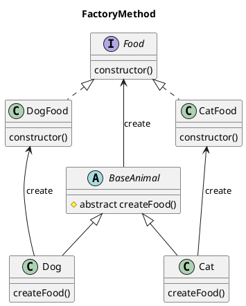
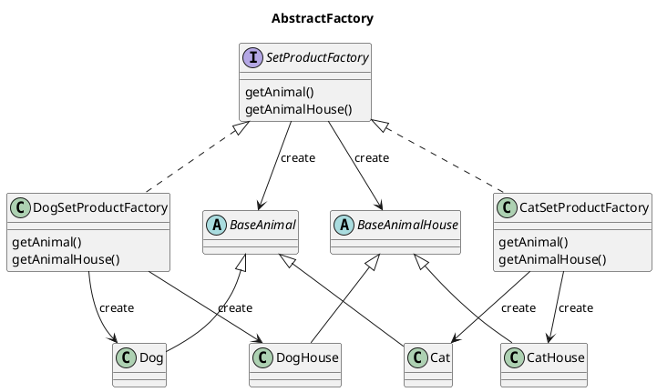
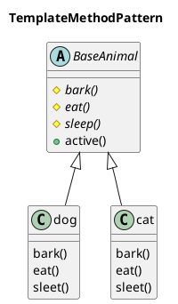
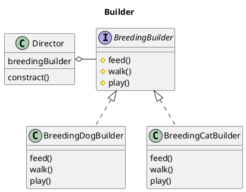

# Gofデザインパターン一覧

## 概要

### 生成に関するもの
#### クラス
- **Factory Method**：動的にサブクラス選択
#### オブジェクト
- **Abstract Factory**：工場の工場
- **Builder**：初期化手順を細分化
- **Prototype**：コピーを渡す
- **Singleton**：１インスタンスを保証

### 構造に関するもの
#### クラス
- （クラス向け）**Adapter**：継承でラッパー
#### オブジェクト
- （オブジェクト向け）**Adapter**：委譲でラッパー
- **Bridge**：拡張と実装の階層分離
- **Composite**：再帰ツリー構造
- **Decorator**：委譲で意図的フック         
- **Facade**：複数クラス利用手順書
- **Flyweight**：キャッシュ付の工場
- **Proxy**：こっそりフック

### 振る舞いに関するもの
#### クラス
- **Interpreter**：独自言語の実行
- **Template Method**：子が処理断片を具体化
#### オブジェクト
- **Chain of Responsibility**：助け船ネットワーク
- **Command**：タスクキューとスタック
- **Iterator**：並んだ物を順番に処理
- **Mediator**：スター状の相互作用
- **Memento**：状態のゲッタとセッタ
- **Observer**：イベントリスナ
- **State**：状態オブジェクト
- **Strategy**：アルゴリズム切り替え
- **Visitor**：構造の便利スキャナ

## 詳細

### ***FactoryMethod***
- **特徴**
  - インスタンスの生成を動的に変更できるようにする。
    1. インスタンス生成用メソッドを子クラスで実装する。
    2. 親クラスのメソッドを呼ぶようにしといて、実際は子クラスで生成したインスタンスを呼び出す。
  - クラス内で利用するオブジェクトを切り替えたい時（CatFoodとDogFood）にcreate()を使って動的に切り替える
- **利点**
  - インスタンスの生成を子クラスによって変更できる
  - クラス間の依存性をごっそり削れる
- **欠点**


**クラス図**


**サンプル**
```java
public class Main {

    public static void main(String[] arg) {
        BaseAnimal cat = new Cat();
        cat.active();
        BaseAnimal dog = new Dog();
        dog.active();
    }
}

public class Food {
    private String name = "";
    private int price = 0;
    private int amount = 0;

    public Food(String name, int price, int amount) {
        this.name = name;
        this.price = price;
        this.amount = amount;
    }
    .
    .
    .
}

public class CatFood extends Food {
    private SizeType sizeType = SizeType.DEFAULT;


    public CatFood(String name, int price, int amount, SizeType sizeType) {
        super();
        this.sizeType = sizeType;
    }
}

public class DogFood extends Food {
    private HardType hardType = HardType.DEFAULT;

    public DogFood(String name, int price, int amount, HardType hardType) {
        super();
        this.hardType = hardType;
    }
}

public abstract class BaseAnimal {
    // 抽象メソッド
    protected abstract String bark();
    protected abstract void eat(Food food);
    protected abstract void sleep();
    //////////////////////////////////////
    // 動的に変更したいインスタン生成用のメソッド
    //////////////////////////////////////
    protected abstract Food createFood();

    public void active() {
        String voice = bark();
        System.out.println(voice);

        /////////////////////////////////////////
        // 子クラスでOverrideして動的にFoodを生成する。
        /////////////////////////////////////////
        Food food = createFood(); 
        eat(food);
        sleep();
    }
}

public class Cat extends BaseAnimal { 

    private String voice = "meow";

    @Override
    public String bark() {
        return voice;
    }
    ・
    ・
    ・
    ////////////////////////////////////////////
    // 動的に変更したいインスタン生成用のメソッド（実装）
    ////////////////////////////////////////////
    @Override
    public Food createFood() {
        return new CatFood();
    }
}

public class Dog extends BaseAnimal {
    ・
    ・
    ・
    ////////////////////////////////////////////
    // 動的に変更したいインスタン生成用のメソッド（実装）
    ////////////////////////////////////////////
    @Override
    public Food createFood() {
        return new DogFood();
    }
}
```

### ***Abstract Factory***
- **特徴**
  - 同様なオブジェクト群をもつクラスをFactoryクラスから呼び出せるようにする
  - DelegateFactoryとDelegateFactoryImpl？(M1)
  ➡︎"オブジェクト群"を取得したいというよりも、ModelとControllerを切り離したい？
  - オブジェクトの切り替え（DogとDogHouseのペアとCatとCatHouseのペア）をFactoryクラスで行う
- **利点**
  - FactoryMethodと同じだと思う
- **欠点**

**クラス図**


**サンプル**
```java
public static void Main {
    // ↓で動物と動物小屋のセットが正確に取得できる
    SetProductFactory factory = new DogSetProductFactory();
    // ↑で生成したfactoryから動物が取得できる
    BaseAnimal animal = factory.getAnimal();
    // ↑で生成したfactoryから動物小屋が取得できる
    BaseAnimalHouse animalHouse = factory.getHouse();
    animal.bark();
    animalHouse.getSize();    
}

public abstract class BaseAnimal {
    ・
    ・
    ・
}
public class Dog extends BaseAnimal {
    ・
    ・
    ・
}
public class Cat extends BaseAnimal {
    ・
    ・
    ・
} 

public abstract class BaseAnimalHouse {
    ・
    ・
    ・
}

/**
 * 犬小屋
 */
public class DogHouse extends BaseAnimalHouse {
    ・
    ・
    ・
} 

/**
 * 猫小屋（ないとは思うけど..）
 */
public class CatHouse extends BaseAnimalHouse {
    ・
    ・
    ・
}

///////////////////////////////////////////////////////////////
// 動物と動物小屋のセット（アニマルショップとかでセットで売ってると思う..）
// Factoryの抽象クラス
///////////////////////////////////////////////////////////////
public interface SetProductFactory {
    public BaseAnimal getAnimal();
    public BaseAnimalHouse getAnimalHouse();
}

////////////////////////////////////////
// 犬と犬小屋のセットを作成するFactoryクラス
// Factoryの具象クラス
////////////////////////////////////////
public class DogSetProductFactory implements SetProductFactory {
    @Override
    getAnimal() {
        return new Dog();
    }
    @Override
    getAnimalHouse() {
        return new DogHouse();
    }
}v

////////////////////////////////////////
// 猫と猫小屋のセットを作成するFactoryクラス
// Factoryの具象クラス
////////////////////////////////////////
public class CatSetProductFactory implements SetProductFactory {
    @Override
    getAnimal() {
        return new Cat();
    }
    @Override
    getAnimalHouse() {
        return new CatHouse();
    }
}

```

### ***TemplateMethod***
- **特徴**
  - 親クラスが処理の枠組みのみを持ち、実装は子クラスに任せる。
  - DelegateとImpl
  - 一連の処理の流れが決まってて具体的には色々パターンがあるときに使う。
- **利点**
  - 実装上の大まかな流れを決めることができる。
  - main()でのインスタンス生成方法は変わらず、処理を変えることができる。
  - 同じような処理をするクラスをいい感じにまとめて、親クラスのメソッドで一気に実行する。
- **欠点**
  - サブクラスの数が増える。
  - 親クラスと子クラスの関連が密接

**クラス図**


**サンプル**
```java
public class Main {

    public static void main(String[] arg) {
        BaseAnimal cat = new Cat();
        cat.active();
        BaseAnimal dog = new Dog();
        dog.active();
    }
}

public class Food {
    private String name = "";   // 名前
    private int price = 0;  // 値段
    private int amount = 0; // 量

    public Food(String name, int price, int amount) {
        this.name = name;
        this.price = price;
        this.amount = amount;
    }
    public getName() {
        ...
    }
    public getPrice() {
        ...
    }
    public getAmoutn() {
        ...
    }
}

//////////////////////////////////////////
// CatとDogという似ているクラスが存在する。
// BaseAnimalを作って、大まかな処理を決めてやる。
//////////////////////////////////////////
public abstract class BaseAnimal {
    // 抽象メソッド
    protected abstract String bark();
    protected abstract void eat(Food food); // ※Food：後々はAnimal毎に食べ物を分けてあげたい。
    protected abstract void sleep(); 

    ////////////////////////////////////////////////
    // 子クラスが実装したであろう各メソッドを実行するメソッド
    ////////////////////////////////////////////////
    public void active() {
        String voice = bark();
        System.out.println(voice);
        Food food = new Food();
        eat(food);
        sleep();
    }
}

public class Cat extends BaseAnimal { 

    private String voice = "meow";

    @Override
    public String bark() {
        return voice;
    }

    @Override
    public void eat(Food food) {
        System.out.println(food.getName() + " eating");
    }

    @Override
    public void sleep() {
        System.out.println("cat is sleeping");
    }
}

public class Dog extends BaseAnimal {
    ・
    ・
    ・
}
```


### ***Builder***
- **特徴**
  - 複雑なオブジェクト生成用のクラスを使う
  - 「作成過程」のDirector「表現形式」のBuilderを組み合わせる
  - 同じ形式のオブジェクトが対象？  
    若干異なってしまえばもう使えない？
- **利点**
  - オブジェクト生成が柔軟にできる
- **欠点**

**クラス図**


**サンプル**
```java
// メインクラス
//
// BreedingBuilder builder = new BreedingDogBuilder(); ⬅︎ ここを切り替えれば処理の流れが同じで、処理対象の切り替えが可能
// Director director = new Director(builder);
// director.constract(); // 犬の世話をする
//
// BreedingBuilder builder = new BreedingCatBuilder();
// Director director = new Director(builder);
// director.constract(); // 猫の世話をする

/**
 * ペットの世話用インターフェース
 */
public interface BreedingBuilder {
    void feed(); // 餌をあげる
    void walk(); // 散歩をする
    void play(); // 遊びをする
}

/**
 * 処理過程を定義するディレクター
 */
public class Director {
    private BreedingBuilder breedingBuilder;
    public Director(BreedingBuilder builder) {
        this.breedingBuilder = builder;
    }

    public constract(){
        this.breedingBuilder.feed();
        this.breedingBuilder.walk();
        this.breedingBuilder.play()
    }
}

/**
 * 犬の世話用クラス
 */
public class BreedingDogBuilder implements BreedingBuilder {
    
    @Override
    public void feed() {
        System.out.println("feed the dog");
    }

    @Override
    public void wald() {
        System.out.println("walk the dog");
    }

    @Override
    public void play() {
        System.out.println("play with the dog");
    }
}

/**
 * 猫の世話用クラス
 */ 
public class BreedingCatBuilder implements BreedingBuilder {
    
    @Override
    public void feed() {
        System.out.println("feed the cat");
    }

    @Override
    public void wald() {
        // 猫とも散歩はできる
        System.out.println("walk the cat");
    }

    @Override
    public void play() {
        System.out.println("play with the cat");
    }
}
```


### ***パターン***
- **特徴**
- **利点**
- **欠点**
**クラス図**

**サンプル**
```java

```